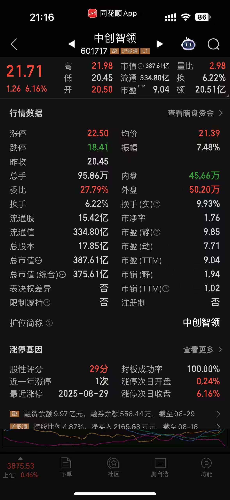

# 股票基础概念入门01 --- 股票基础知识

> 价值投资视角的极简笔记（长期更新）

- 作者：小散没心得
- 版本：v1.0
- 说明：本文聚焦**长期价值**与**可交易规模**，不讨论短期波动。

---

## 目录
- [什么是股票](#什么是股票)
- [拥有股票的好处](#拥有股票的好处)
- [股票的核心属性](#股票的核心属性)
  - [总股本](#总股本)
  - [流通股](#流通股)
  - [为什么总股本 ≠ 流通股本](#为什么总股本--流通股本)
- [市值怎么理解](#市值怎么理解)
  - [单市场公司的市值](#单市场公司的市值)
  - [多市场（A+H/ADR）公司的市值](#多市场ahadr公司的市值)
- [如何快速查证股本结构](#如何快速查证股本结构)
- [总结](#总结)

---

## 前言

这是一本我会持续输出的文章，输出的目的主要用于学习和总结价值投资之路，这也将是我唯一一本投资的武学秘籍，希望未来读到这些文章的人，也能从中受到启发，成为一名真正的价值投资者，由于所有文章都立意于价值投资，所以文章中很多概念性知识可能会穿插价值投资的逻辑和思考

## 什么是股票

1. 公司在融资时，会把自身“拆分”为许多等份，每一份就是**一股**。
2. 投资者买入股份就成为**股东**，拥有相应的**所有权**与**权益**。

> 例：公司拆分为 100 股，你持有 1 股 ⇒ 你拥有公司 **1%** 的权益。

---

## 拥有股票的好处

1. **分享利润**：公司分红时，你按持股比例获得分红。
2. **资产增值**：公司长期经营变好，股价上涨，卖出获得差价收益。
3. **性价比的财富增长路径**：长期回报**通常高于存款**；与创业相比，**风险与精力投入**更可控。

> 价值投资关注：**企业长期盈利能力** 与 **合理价格买入**。

---

## 股票的核心属性

> 作为价值投资者，更关注“企业价值”和“可交易规模”，而非短期价格噪音。

### 总股本

- **定义**：公司发行的全部股份。
- **示例**：以图示为例，中创智领总股本为 **17.85 亿股**。

### 流通股

- **定义**：总股本中，**可以在二级市场自由交易**的那部分。
- **示例**：中创智领流通股为 **15.42 亿股**；其余约 **2.43 亿股**在港股市场流通，两者合计与总股本 **17.85 亿股**一致。

#### 为什么总股本 ≠ 流通股本

常见原因（至少满足其一）：

1. **限售股（锁定股）**：大股东、员工或战投持股在锁定期内不可卖出。
2. **国有股 / 法人股**：在特定市场或阶段，部分股份**长期不流通**。
3. **公司回购（库存股）**：被公司回购的股份**不参与流通**（总股本不变，流通股减少）。
4. **员工持股计划（RSU/期权）**：**解禁前**计入总股本但**不可交易**。
5. **跨市场上市**：A 股 / H 股 / 美股 ADR 等多个市场**各自有独立的流通安排**。

> 🔎 快速判断：看“限售比例”“库存股”“股权激励”“跨市场发行”等关键词。

---

## 市值怎么理解

- **总市值** = 总股本 × 股价  
- **流通市值** = 流通股本 × 股价

> 一般分析中，**流通市值**更能反映“实际可交易的资金规模”。

### 单市场公司的市值

- 若公司只在一个市场上市，直接使用上述公式即可。
- 价值投资视角：更关注**流通市值**与**估值水平（如 PE、PB、股息率）**的匹配。

### 多市场（A+H/ADR）公司的市值

> 不同市场的**投资者结构、汇率、流动性**不同，**定价可能显著差异**。

更合理的总市值计算是**分市场加总**：

总市值 = A 股流通股本 × A 股股价
+ H 股流通股本 × H 股股价
(+ 其他市场流通股本 × 对应市场股价 …)

- 以中创智领为例：同时在 A 股、港股上市，因此**应分别计算市值后再相加**，而不是用单一市场的股价乘以全部股本。

> 💡 这样做的好处：更准确反映公司在各市场被赋予的**真实估值**，避免高估或低估。

---

## 如何快速查证股本结构

- **行情网站**：东方财富 / 同花顺 / 雪球 →「股本结构」「解禁时间表」「回购/激励公告」。
- **公司公告**：招股说明书、年报/季报 →「股本结构表」「限售与解禁安排」「回购与库存股」「股权激励计划」。

> 建议做一个个人“核查清单”：
> - 总股本与流通股本是否匹配？
> - 限售比例与解禁节奏如何？
> - 是否有库存股或正在回购？
> - 是否多地上市？各市场股价与流通规模如何？

---

## 总结

- **股票 = 企业所有权的份额**；买股票就是与企业长期共赢的契约。
- **总股本**是公司发行总量，**流通股**是可交易部分；二者常常不相等。
- **流通市值**比总市值更贴近市场实际交易规模。
- **跨市场上市**公司应按**分市场分别估值后加总**，更能客观反映整体价值。
- 价值投资的核心：**研究企业基本面 + 在合适价格买入 + 足够的持有时间**。

---
